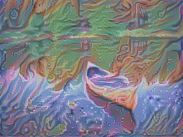

Neural Style Transfer - CLI
===========================

Create artificial artwork by transfering the appearance of one image (eg a famous painting) to another
user-supplied image (eg your favourite photograph).

| |Demo_Content_Image| + |Demo_Style_Image|
| =
| |Demo_Gen_Image|

Uses a Neural Style Transfer algorithm to transfer the appearance, which you can run though a CLI program.

`Neural Style Tranfer` (NST) is an algorithm that applies the `style` of an image to the `contents` of another and produces a `generated` image.
The idea is to find out how someone, with the `painting style` shown in one image, would depict the `contents` shown in another image.

NST takes a `content` image (eg picture taken with your camera) and a `style` image (eg a picture of a Van Gogh painting) and produces the `generated` image.

This Python package runs a Neural Style Tranfer algorithm on input `content` and `style` images to produce `generated` images.

.. start-badges

.. list-table::
    :stub-columns: 1

    * - build
      - | |ci_pipeline| |docs| |codecov|

    * - package
      - | |pypi| |wheel| |py_versions| |commits_since|

    * - containerization
      - | |docker| |image_size|

    * - code quality
      - |codacy| |code_climate| |maintainability| |scrutinizer|

| **Docs**: https://boromir674.github.io/neural-style-transfer/

Overview
========

This package exposes a configurable NST algorithm via a convenient CLI program.

Key features of the package:

* Selection of style layers at runtime
* Iterative Learning Algorithm using the VGG Deep Neural Network
* Selection of iteration termination condition at runtime
* Fast minimization of loss/cost function with parallel/multicore execution, using Tensorflow
* Persisting of generated images

Quick-start
-----------

| Run a demo NST, on sample `Content` and `Style` Images:

::

    mkdir art
    export NST_HOST_MOUNT="$PWD/art"

    docker-compose up

    # Process runs, in containerized environment, and exits.

| Check out your **Generated Image**!
| Artificial Artwork: **art/canoe_water_w300-h225.jpg+blue-red_w300-h225.jpg-100.png**

::

    xdg-open art/canoe_water_w300-h225.jpg+blue-red_w300-h225.jpg-100.png

Usage
-----

Run the `nst` CLI with the `--help` option to see the available options.

::

    docker run boromir674/neural-style-transfer:1.0.2 --help

Development
-----------

Installation
""""""""""""

Install `nst` CLI and `artificial_artwork` python package from `pypi``:

::

    pip install artificial_artwork

Only python3.8 wheel is included atm.

Sample commands to install the NST CLI from source, using a terminal:

::

    git clone https://github.com/boromir674/neural-style-transfer.git
    
    pip install ./neural-style-transfer

| The Neural Style Transfer - CLI heavely depends on Tensorflow (tf) and therefore it is crucial that tf is installed correctly in your Python environment.

.. |ci_pipeline| image:: https://img.shields.io/github/actions/workflow/status/boromir674/neural-style-transfer/test.yaml?branch=master&label=build&logo=github-actions&logoColor=233392FF
    :alt: CI Pipeline Status
    :target: https://github.com/boromir674/neural-style-transfer/actions?query=branch%3Amaster++ 

.. |github_actions_ci|  image:: https://img.shields.io/github/actions/workflow/status/boromir674/neural-style-transfer/test.yaml?link=https%3A%2F%2Fgithub.com%2Fboromir674%2Fneural-style-transfer%2Factionsbranch=master
   :alt: GitHub Workflow Status
   :target: https://github.com/boromir674/neural-style-transfer/actions?query=branch%3Amaster++

.. |circleci|  image:: https://img.shields.io/circleci/build/github/boromir674/neural-style-transfer/master?logo=circleci
    :alt: CircleCI
    :target: https://circleci.com/gh/boromir674/neural-style-transfer/tree/master

.. |codecov| image:: https://codecov.io/gh/boromir674/neural-style-transfer/branch/master/graph/badge.svg
    :alt: Codecov
    :target: https://app.codecov.io/gh/boromir674/neural-style-transfer/tree/master
    

.. |pypi| image:: https://img.shields.io/pypi/v/artificial-artwork?color=blue&label=pypi&logo=pypi&logoColor=%23849ed9
    :alt: PyPI
    :target: https://pypi.org/project/artificial-artwork/

.. |wheel| image:: https://img.shields.io/pypi/wheel/artificial-artwork?logo=python&logoColor=%23849ed9
    :alt: PyPI - Wheel
    :target: https://pypi.org/project/artificial-artwork

.. |py_versions| image:: https://img.shields.io/pypi/pyversions/artificial-artwork?color=blue&logo=python&logoColor=%23849ed9
    :alt: PyPI - Python Version
    :target: https://pypi.org/project/artificial-artwork

.. |version| image:: https://img.shields.io/pypi/v/artificial-artwork.svg
    :alt: PyPI Package latest master
    :target: https://pypi.org/project/artificial-artwork

.. |commits_since| image:: https://img.shields.io/github/commits-since/boromir674/neural-style-transfer/v1.0.1/master?color=blue&logo=Github
    :alt: GitHub commits since tagged version (branch)
    :target: https://github.com/boromir674/neural-style-transfer/compare/v1.0.1..master

.. |codacy| image:: https://app.codacy.com/project/badge/Grade/07b27ac547a94708aefc5e845d2b6d01
    :alt: Codacy
    :target: https://www.codacy.com/gh/boromir674/neural-style-transfer/dashboard?utm_source=github.com&amp;utm_medium=referral&amp;utm_content=boromir674/neural-style-transfer&amp;utm_campaign=Badge_Grade

.. |code_climate| image:: https://api.codeclimate.com/v1/badges/2ea98633f88b75e87d1a/maintainability
   :alt: Maintainability
   :target: https://codeclimate.com/github/boromir674/neural-style-transfer/maintainability

.. |maintainability| image:: https://img.shields.io/codeclimate/tech-debt/boromir674/neural-style-transfer?logo=CodeClimate
    :alt: Technical Debt
    :target: https://codeclimate.com/github/boromir674/neural-style-transfer/maintainability

.. |scrutinizer| image:: https://img.shields.io/scrutinizer/quality/g/boromir674/neural-style-transfer/master?logo=scrutinizer-ci
    :alt: Scrutinizer code quality
    :target: https://scrutinizer-ci.com/g/boromir674/neural-style-transfer/?branch=master

.. |docs| image:: https://readthedocs.org/projects/neural-style-transfer/badge/?version=latest
    :alt: Documentation Status
    :target: https://neural-style-transfer.readthedocs.io/en/latest/?badge=latest

.. |docker| image:: https://img.shields.io/docker/v/boromir674/neural-style-transfer/latest?logo=docker&logoColor=%23849ED9
    :alt: Docker Image Version (tag latest semver)
    :target: https://hub.docker.com/r/boromir674/neural-style-transfer

.. |image_size| image:: https://img.shields.io/docker/image-size/boromir674/neural-style-transfer/latest?logo=docker&logoColor=%23849ED9
    :alt: Docker Image Size (tag)

.. |Demo_Content_Image| image:: ./tests/data/canoe_water_w300-h225.jpg
  :width: 300
  :alt: Demo Content Image

