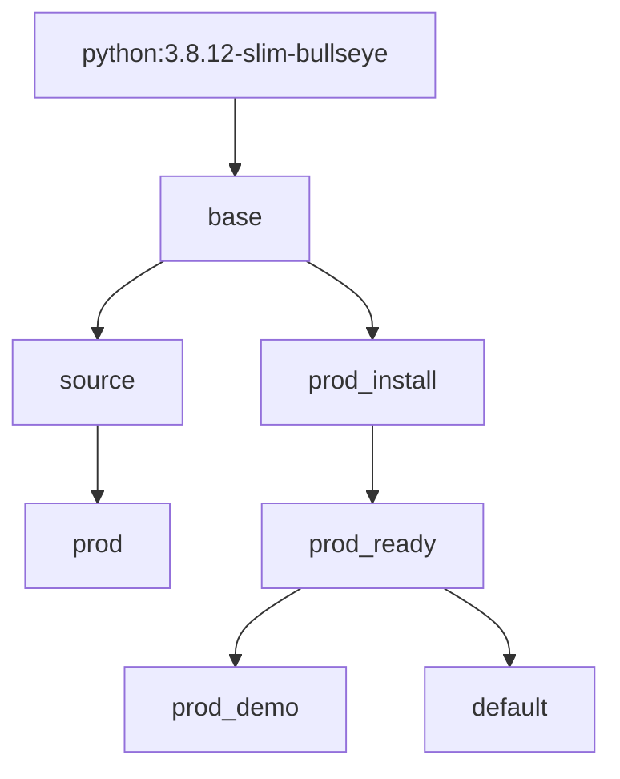

## Docker Build Process DAG

`docker build`  possible execution paths.

Flow Chart, of how exection navigates docker stages (see --target of docker build).

If you run `docker build .` the `target` used by default is the `default` Stage in the Graph.

**Dockerfile: ./Dockerfile**

Note, The below Graph represents only `FROM first_stage AS second_stage`.
We will add representation for `COPY --from=other_stage .`, later.

