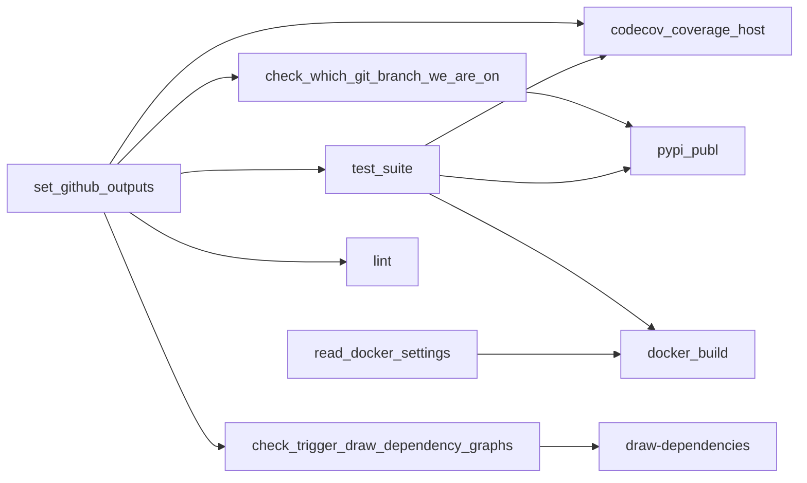

## CICD Pipeline, as single Github Action Workflow

Flow Chart, of how the Jobs are connected in the Pipelinebuild).

**config: ./.github/workflows/test.yaml**

graph TB;

```mermaid
graph LR;
  set_github_outputs --> test_suite
  test_suite --> codecov_coverage_host
  set_github_outputs --> codecov_coverage_host
  set_github_outputs --> check_which_git_branch_we_are_on
  test_suite --> pypi_publ
  check_which_git_branch_we_are_on --> pypi_publ
  read_docker_settings --> docker_build
  test_suite --> docker_build
  set_github_outputs --> lint
  set_github_outputs --> check_trigger_draw_dependency_graphs
  check_trigger_draw_dependency_graphs --> draw-dependencies
```
